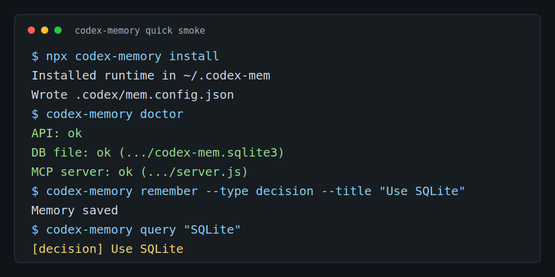

<p align="center">
  
</p>

<p align="center">
  <a href="https://www.npmjs.com/package/codex-memory"></a>
  <a href="https://www.npmjs.com/package/codex-memory"></a>
  <a href="https://www.npmjs.com/package/codex-memory"></a>
  
  
</p>

# codex-memory

Project-local memory for Codex agents.

Codex starts every session without knowing what happened before. `codex-memory`
stores validated project memory locally and makes it available to future Codex
sessions.

## Why?

Without memory:

- Codex repeats the same mistakes
- old decisions get lost
- every session starts from zero

With `codex-memory`:

- Codex can recall previous project decisions
- reuse known fixes
- inject relevant context automatically

## Quick Start

```bash
npx codex-memory install
codex-memory doctor
```

Restart Codex.

Try it:

```bash
codex-memory remember \
  --type decision \
  --title "Use SQLite for local storage" \
  --context "Storage decision" \
  --resolution "Use SQLite as the local source of truth."

codex-memory query "SQLite"
```

## First Successful Run

1. Install:

```bash
npx codex-memory install
```

2. Check:

```bash
codex-memory doctor
```

3. Save memory:

```bash
codex-memory remember \
  --type fact \
  --title "Project uses Next.js" \
  --context "Frontend stack"
```

4. Query it:

```bash
codex-memory query "frontend stack"
```

If this works, `codex-memory` is ready.

## Who Is This For?

`codex-memory` is for developers who use Codex on real codebases and want the
agent to remember:

- architecture decisions
- solved bugs
- project conventions
- recurring fixes
- implementation patterns

## Privacy

`codex-memory` is local-first.

- memory is stored locally in SQLite
- no hosted service is required
- do not store secrets, API keys, tokens, credentials, or personal data

## What Gets Installed?

- local SQLite memory database
- Codex plugin hooks
- local memory API
- MCP tools for Codex

## Common Commands

| Command                  | What it does        |
| ------------------------ | ------------------- |
| `codex-memory remember`  | save memory         |
| `codex-memory query`     | search memory       |
| `codex-memory status`    | check worker/API    |
| `codex-memory doctor`    | diagnose setup      |
| `codex-memory uninstall` | remove from project |

## Terminal Demo



```text
$ codex-memory remember --type bug --title "Vite build fails on Windows"
✓ Memory saved

$ codex-memory query "Vite Windows"
Found 1 memory:
[bug] Vite build fails on Windows
Solution: use cross-env for NODE_ENV
```

## Before codex-memory

User: Fix the failing build.

Codex: Tries the same broken approach from last week.

## After codex-memory

Codex checks memory:

- known issue: build fails on Windows because `NODE_ENV` is set incorrectly
- solution: use `cross-env`

Then applies the known fix.

## Example Memories

See [memory type examples](docs/memory-types.md) for `fact`, `decision`,
`bug`, `solution`, and `pattern` entries with realistic commands and expected
query output.

### Architecture Decision

```bash
codex-memory remember \
  --type decision \
  --title "Use Prisma migrations" \
  --context "Database schema changes" \
  --resolution "All schema changes must go through Prisma migrations."
```

### Known Bug

```bash
codex-memory remember \
  --type bug \
  --title "Tests fail when API worker is offline" \
  --context "Local test setup" \
  --resolution "Run codex-memory doctor before integration tests."
```

### Project Pattern

```bash
codex-memory remember \
  --type pattern \
  --title "Use service layer for database writes" \
  --context "Backend architecture" \
  --resolution "Routes should call services, not database code directly."
```

## How It Works

```text
Codex session
     ↓
codex-memory hook
     ↓
Local SQLite memory
     ↓
Relevant memories
     ↓
Injected context
     ↓
Better Codex answer
```

## Current Status

Supported:

- local SQLite memory
- CLI memory commands
- local API
- MCP tools
- Codex hooks

Not supported yet:

- hosted cloud sync
- team authorization
- managed dashboard
- encrypted remote memory

## FAQ

### Does it send my code to a server?

No. Memory is local-first and stored in SQLite.

### Do I need MCP?

For basic CLI usage, no. MCP is used for agent integration.

### Does it work without Codex?

The CLI can store and query memory, but the main integration target is Codex.

### Where is memory stored?

By default under `~/.codex-mem`.

### How do I reset everything?

Run `codex-memory uninstall` and remove the local memory directory.

## Developer Docs

See [docs/development.md](docs/development.md) for repository setup, local API/MCP development, publishing checks, and CI commands.

Focused guides:

- [Windows install](docs/windows-install.md)
- [Memory type examples](docs/memory-types.md)
- [MCP integration](docs/mcp-integration.md)
- [Team benefits](docs/team-benefits.md)
- [Comparison with Codex memories](docs/codex-memories-comparison.md)

## Status

Beta. Local-first. Do not store secrets.
